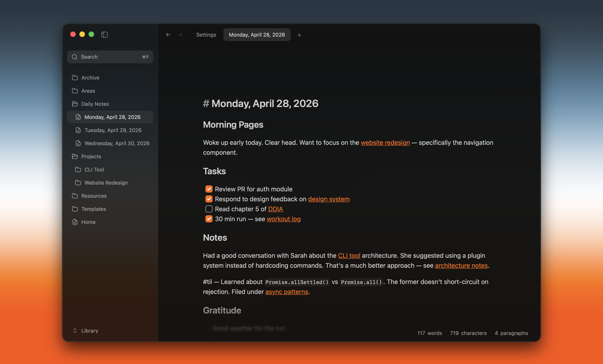

# Writer

Fast and lightweight app for your workspace's Markdown and MDX files



It is built with Tauri v2, React, Zustand, CodeMirror, and Rust. The app keeps documents on disk, respects workspace `.gitignore` rules, supports multiple windows, renders extended markdown such as tables and Mermaid diagrams, and ships with a signed macOS release flow.

## Fork Notice

This repository is a customized fork of [Writer Computer](https://github.com/joelbqz/writer-computer).

The original project copyright belongs to its original authors. This fork contains modifications by the maintainers of this repository beginning on 2026-07-05.

This fork is independently maintained. Issues, releases, binaries, signatures, updater metadata, and support for this fork are handled by this repository's maintainers.

## Changes From Upstream

This fork may include changes to product direction, desktop app behavior, release configuration, branding, and local development workflow.

Release-level changes are tracked in [CHANGELOG.md](./CHANGELOG.md). Implementation notes and feature specs live in [SPECs/](./SPECs/).

## License

This fork is distributed under the GNU General Public License v3.0. See [LICENSE](./LICENSE).

The full corresponding source code for released binaries is available from this repository through the matching Git tag or release archive.

The software is provided without warranty to the extent permitted by GPLv3.

## Repository

- `apps/desktop/` — Tauri desktop app.
- `apps/desktop/src/` — React frontend.
- `apps/desktop/src-tauri/src/` — Rust commands, workspace state, watcher, updater, and CLI integration.
- `docs/` — project and agent workflow docs.
- `SPECs/` — feature specs and design notes.

## Development

This repo uses Vite+ through the `vp` CLI. Use `vp` instead of calling the package manager or Vite tooling directly.

```bash
vp install
vp dev
```

## Validation

```bash
vp check
vp test
```

Rust validation runs from the Tauri crate:

```bash
cd apps/desktop/src-tauri
cargo test
cargo clippy
cargo fmt --check
```

## Releases

macOS releases are cut locally with `scripts/distribute.sh`. See `docs/releasing.md` for the signed, notarized release workflow and updater publishing details.
